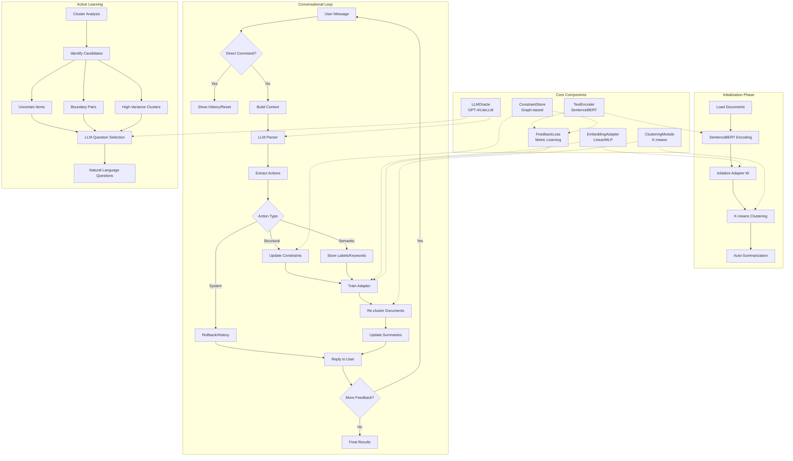

# Conversational Clustering with Human-in-the-Loop

This project implements a **conversational clustering system** that iteratively refines text clusters through natural language human feedback. The system combines metric learning, active learning, and LLM-driven dialogue to achieve clustering results that match human conceptual understanding.

## Algorithm Overview

### Core Problem

Given a set of texts $X = \{x_1, \dots, x_N\}$, find clusters $C = \{C_1, \dots, C_K\}$ that align with human semantic categories, using limited conversational feedback rather than explicit labels.

### Key Innovation

Traditional clustering uses fixed similarity metrics. Our approach **learns a task-specific metric space** $W$ that adapts to user feedback, combined with **active learning** to select the most informative questions.

## Conversational Hypothesis Strategies

At a high level, conversational clustering can incorporate **hypotheses about what defines a cluster** in two complementary ways:

### 1. Active Conversational Hypothesis Generation (Conceptual / Future Direction)

In an **active** approach, the LLM does not just react to feedback; it **proposes explicit, testable hypotheses** about why items belong together and then probes the user to confirm or refute them. Conceptually, this is close to the *HypoGeniC* framework from the paper *“Hypothesis Generation with Large Language Models”* (arXiv:2404.04326), which:

- generates candidate natural-language hypotheses from examples,
- tests them against labeled data to estimate their predictive value, and
- iteratively refines a hypothesis bank using an exploration–exploitation strategy.

Transposed to conversational clustering, an active hypothesis loop could look like:

- **Hypothesis proposal**: given current clusters and prior feedback, the LLM posits rules such as *“Login issues typically mention passwords, authentication, or 2FA”* or *“Refund-related tickets mention ‘refund’, ‘chargeback’, or ‘credit card’”*.
- **Interactive testing**: the system asks targeted questions (“Do all login issues involve authentication failures?”, “Are billing questions without ‘refund’ still part of this cluster?”) to validate or reject these rules with the user.
- **Hypothesis selection and generalization**: validated hypotheses are retained as global, interpretable rules that can be re-used on new data, transferred across models, or used as transparent decision criteria for clustering and inference.

This style of interaction is **model-driven and exploratory**: the system actively searches for *global*, human-interpretable rules, rather than waiting for the user to localize each error. It is especially useful when:

- you want **interpretable cluster definitions** (e.g., for scientific or policy applications),
- you care about **generalization to new domains or models**, and
- you are willing to pay additional **LLM cost and latency** for richer reasoning loops.

### 2. Reactive Hypothesis Extraction via Templates (Current Implementation)

The method implemented in this repository is primarily **reactive**: the user provides feedback in natural language, and the LLM maps that feedback onto a **predefined set of feedback templates** (the `Feedback Actions` such as `must_link`, `cannot_link`, `merge_clusters`, `rename_cluster`, `emphasize_feature`, `miscluster`, `subcluster`).

In this view, each feedback instance can be interpreted as a **localized hypothesis** about the structure of the embedding space:

- A `must_link(i, j)` action encodes the hypothesis *“items i and j should be close in the task-adapted metric space”*.
- A `cannot_link(i, j)` action encodes *“items i and j should be far apart in the task-adapted metric space”*.
- A `merge_clusters(A, B)` action encodes *“clusters A and B instantiate the same underlying concept”*.
- An `emphasize_feature("refund")` action encodes *“the presence of the term ‘refund’ is a salient feature for drawing cluster boundaries”*.

These hypotheses are **not stored as long natural-language rules**, but rather **translated into optimization constraints** and structural edits:

- metric-learning constraints in the feedback loss $L_{fb}$,
- updates to the constraint graph (must-/cannot-link),
- semantic labels and keywords that influence summaries and future reasoning.

Because the hypothesis extraction is template-based, this approach is:

- **Stable and controllable** – every feedback instance is mapped onto a well-defined operation with predictable effects on the embedding space and clustering.
- **Optimization-friendly** – constraints flow directly into the differentiable objective $L_{total}$, making it straightforward to update the adapter $W$.
- **Low-latency and cost-effective** – the system does not need to maintain or search over an explicit bank of global hypotheses; it simply reacts to user corrections and semantic hints.

In practice, this reactive strategy already yields a **conversational hypothesis process**: the user states informal rules in natural language, the LLM parses them into structured actions, and those actions are enforced as constraints on the learned metric. An interesting future direction is to **hybridize** the two paradigms—using the current template-based reactive engine as a backbone, while layering an active hypothesis generator (inspired by HypoGeniC) that proposes and tests higher-level rules when sufficient feedback has accumulated.

### Mathematical Formulation

#### 1. Representation Learning

- **Base Embeddings**: $h_i = \phi(x_i) \in \mathbb{R}^d$ using a SentenceTransformer model (SentenceBERT family)
- **Adapted Embeddings**: for each head $h$, $z_i^{(h)} = W^{(h)} h_i \in \mathbb{R}^p$ where each $W^{(h)}$ is a learned projection (linear or small MLP) in the multi-head `EmbeddingAdapter`
- **Clustering**: $c_i = \arg\min_k ||z_i - \mu_k||^2$ using k-means (implemented with scikit-learn `MiniBatchKMeans` on the flattened multi-head embeddings)

#### 2. Objective Function

The system optimizes:
$$L_{total} = L_{cluster} + \lambda_{fb} L_{fb}$$

- **Clustering Loss**: $L_{cluster} = \frac{1}{N} \sum_i ||z_i - \mu_{c_i}||^2$
- **Feedback Loss**: $L_{fb} = \sum_{(i,j) \in \mathcal{M}} \max(0, ||z_i - z_j||^2 - m_{ML}) + \sum_{(i,j) \in \mathcal{C}} \max(0, m_{CL} - ||z_i - z_j||^2)$

Where $\mathcal{M}$ are must-link pairs, $\mathcal{C}$ are cannot-link pairs, and $m_{ML}, m_{CL}$ are margin parameters.  
In the actual implementation, $L_{fb}$ is instantiated by `FeedbackLoss` and also includes additional terms for **miscluster flags**, **concept/label anchoring**, **cluster splits**, and **keyword emphasis**, all combined into a single differentiable objective.

## Detailed Algorithm

### Phase 1: Initialization

1. **Text Encoding**: Compute base embeddings $h_i$ for all documents using a frozen SentenceTransformer encoder
2. **Adapter Initialization**: Initialize the multi-head `EmbeddingAdapter` (linear or small MLP projections)
3. **Initial Clustering**: Apply MiniBatch K-means to adapted embeddings $z_i$ (flattened multi-head space)
4. **Auto-Summarization**: Extract simple frequency-based keywords and generate cluster titles

### Phase 2: Conversational Loop

#### Step 2.1: Active Learning - Question Selection

1. **Candidate Generation**:
   - **Uncertain Items**: Items with small margin between top-2 cluster distances
   - **Boundary Pairs**: Items close in embedding space but different clusters
   - **High-Variance Clusters**: Clusters with internal spread above threshold

2. **Question Formulation**: LLM selects 2-3 most informative candidates and generates natural language questions with context:
   - "These items are close but in different clusters. Should they be together?"
   - "This cluster has high variance. What topic does it represent?"

#### Step 2.2: User Interaction

- User responds in natural language (e.g., "Items 0 and 1 are both about login issues")
- LLM parses response into structured **Feedback Actions**

#### Step 2.3: Constraint Processing

- **Action Types**:
  - `must_link`: Items must be in same cluster
  - `cannot_link`: Items must be in different clusters
  - `merge_clusters`: Combine existing clusters
  - `rename_cluster`: Assign semantic label
  - `emphasize_feature`: Focus on specific keywords/concepts
  - `miscluster`: Item is in wrong cluster
  - `subcluster`: Split cluster into sub-groups
  - `assign_outlier`: Assign an outlier item to a target cluster
  - `rollback` / `reset_session` / `show_history`: System-level actions for inspecting and undoing previous steps

#### Step 2.4: Model Update

1. **Add Constraints**: Store feedback in constraint graph
2. **Metric Learning**: Optimize $W$ using feedback loss for several epochs
3. **Re-clustering**: Run K-means on updated embeddings
4. **Re-summarization**: Update cluster titles and keywords

#### Step 2.5: Convergence Check

- Continue until user satisfaction or budget exhausted
- Track metrics: constraint satisfaction, cluster stability

### Phase 3: Finalization

- Return final clusters with semantic labels and summaries

## Core Components

### 1. Encoder & Adapter

- **SentenceTransformer (SentenceBERT)**: Provides semantic text embeddings via `TextEncoder`
- **Embedding Adapter**: Multi-head `EmbeddingAdapter` (linear or small MLP per head) that adapts to the clustering task
- **Normalization**: L2-normalization in the adapter ensures cosine-similarity-like behavior per head

### 2. Clustering Module

- **Algorithm**: Scikit-learn `MiniBatchKMeans` (k-means++) with normalization and numerical safeguards
- **Features**: Tracks centroids, computes cluster statistics, exposes cluster variance
- **Integration**: Updates after each feedback round using the current adapted embeddings

### 3. Chat-Driven Feedback Loop

- **LLM Oracle** (`litellm`): Unified interface to GPT-4, Claude, etc.
- **Feedback Actions**: Structured representation of user intent
- **Feedback Executors**: Modular handlers for each action type

### 4. Constraint Store

- **Must/Cannot Links**: Graph-based constraint storage
- **Cluster Labels**: Semantic naming ($C_k \rightarrow$ "Login Issues")
- **Keyword Emphasis**: User-specified focus terms
- **Consistency Checks**: Prevents conflicting constraints

### 5. Auto-Summarization

- **Keyword Extraction**: Count-based keyword extraction (`CountVectorizer`) on cluster documents
- **Title Generation**: Combines top keywords or user-provided labels, while preserving user renames when present
- **Context Enrichment**: Provides rich metadata (titles, keywords, examples) for LLM reasoning

## System Architecture



## Technical Workflow

### Initialization Sequence

Conceptual pseudo-code for what the engine does under the hood (in practice, `ClusterRefinementEngine` wraps `TextEncoder`, `EmbeddingAdapter`, and `ClusteringModule` for you):

```python
# 1. Load and encode documents
texts = ["Document 1", "Document 2", ...]
encoder = TextEncoder()
h = encoder.encode(texts)           # [N, d] base embeddings

# 2. Adapt embeddings and cluster
adapter = EmbeddingAdapter(input_dim=h.shape[1], output_dim=h.shape[1], num_heads=1)
z = adapter(torch.tensor(h)).detach().cpu().numpy()   # [N, num_heads, p]
clustering = ClusteringModule(n_clusters=5)
labels = clustering.fit_predict(z)   # [N] - cluster assignments

# 3. Generate summaries (simple keyword extraction)
from sklearn.feature_extraction.text import CountVectorizer
vectorizer = CountVectorizer(stop_words="english", max_features=10)

for cluster in range(5):
    cluster_docs = [texts[i] for i in np.where(labels == cluster)[0]]
    if not cluster_docs:
        continue
    X = vectorizer.fit_transform(cluster_docs)
    keywords = vectorizer.get_feature_names_out()
    title = f"{keywords[0]}/{keywords[1]}" if len(keywords) >= 2 else f"Cluster {cluster}"
```

### Conversational Round

```python
# User input
user_msg = "Items 0 and 1 should be together"

# 1. LLM parses intent
response = llm.chat_with_feedback(history, context)
# Returns: [{"type": "must_link", "item_ids": [0, 1]}]

# 2. Apply constraints
constraint_store.add_must_link(0, 1)

# 3. Metric learning update
for epoch in range(10):
    optimizer.zero_grad()
    z = adapter(h)  # Updated embeddings
    loss = clustering_loss(z, centroids) + feedback_loss(z, constraints)
    loss.backward()
    optimizer.step()

# 4. Re-cluster and summarize
labels = kmeans.fit_predict(z)
generate_cluster_summaries()
```

## Feedback Action Types

### Structural Actions

- **`must_link`**: Forces items to same cluster
  - Loss: Minimizes distance between linked items
  - Use: "Items 0 and 1 are related"

- **`cannot_link`**: Forces items to different clusters
  - Loss: Maximizes distance between linked items
  - Use: "Items 2 and 3 are completely different"

- **`merge_clusters`**: Combines existing clusters
  - Implementation: Creates must-links between cluster representatives
  - Use: "Clusters A and B are actually the same topic"

### Semantic Actions

- **`rename_cluster`**: Assigns human-readable label
  - Storage: `cluster_labels[cluster_id] = "Login Issues"`
  - Display: Overrides auto-generated titles
  - Use: "Call cluster 0 'Authentication Problems'"

- **`emphasize_feature`**: Focuses on specific concepts
  - Storage: `emphasized_keywords.add("latency")`
  - Effect: Adds a keyword-anchoring term in `FeedbackLoss` that pulls embeddings toward the emphasized concept
  - Use: "Pay attention to 'timeout' issues"

### Diagnostic / Structural Actions

- **`miscluster`**: Item is in wrong cluster
  - Implementation: Flags items so the optimizer pushes them away from their current centroids, encouraging reassignment
  - Use: "Item 5 doesn't belong here"

- **`subcluster`**: Split cluster into sub-groups
  - Implementation: Marks clusters for splitting and adds a variance/“tightness” penalty so MiniBatchKMeans can naturally separate subgroups
  - Use: "Cluster 2 is too mixed, split it"

### System / Utility Actions

- **`assign_outlier`**: Assign an outlier item into an existing cluster
  - Implementation: Creates must-links between the outlier and representative items from the target cluster
  - Use: "Assign this outlier ticket to cluster 1"

- **`rollback` / `reset_session` / `show_history`**: Inspect or revert system state
  - Implementation: Managed by the engine via checkpoints and `SystemState`
  - Use: "Undo the last step", "Reset the session", "Show what happened so far"

## Implementation Details

### Active Learning Strategy

The system uses **multi-criteria active learning**:

1. **Uncertainty Sampling**: Items with small margin between top-2 clusters
2. **Boundary Detection**: Pairs close in embedding space but different clusters
3. **Cluster Quality**: High-variance clusters needing attention
4. **Diversity**: Avoid asking about similar items repeatedly

### Constraint Consistency

- **Graph-based Storage**: Must-links form connected components
- **Conflict Resolution**: Cannot-link between connected components is ignored with a warning, preventing inconsistent constraints
- **Transitivity**: If A-B and B-C, then A-C automatically

### Optimization Details

- **Batching & Scalability**: Text encoding uses batches; clustering uses `MiniBatchKMeans`; training currently runs over all items per step but can be mini-batched in future
- **Gradient Flow**: Only adapter weights $W$ are trainable; the SentenceTransformer encoder remains frozen
- **Loss Balancing**: $\lambda_{fb} = 1.0$ with per-constraint weights in `FeedbackLoss` prioritizes user constraints
- **Convergence**: 3–5 epochs per feedback round (the demo uses 3 epochs per feedback via `train_step(epochs=3)`)

## Usage

### Requirements

```bash
pip install -r requirements.txt
```

Ensure `OPENAI_API_KEY` (or other provider keys supported by `litellm`) is set.

### Running the Demo

```bash
python3 main.py
```

This launches a conversational session where you can give feedback like:

- "Items 0 and 1 should be together." → `must_link`
- "Items 2 and 5 are different topics." → `cannot_link`
- "Cluster 0 should be called 'Login Issues'." → `rename_cluster`
- "Focus on the keyword 'refund' for grouping." → `emphasize_feature`
- "Merge cluster 0 and cluster 1." → `merge_clusters`

The system uses `litellm` to call the LLM, so ensure your API key (e.g., `OPENAI_API_KEY`) is set.

### API Usage

```python
from src.engine import ClusterRefinementEngine

# Initialize
engine = ClusterRefinementEngine(texts, n_clusters=5)

# Get active learning suggestions
questions = engine.propose_feedback_questions(max_questions=3)

# Process user feedback
reply = engine.chat("Items 0 and 1 should be together")

# Get final results
summaries = engine.get_cluster_summaries()
```

## Performance Characteristics

### Scalability

- **Documents**: Tested up to 10K items
- **Clusters**: 3-20 clusters typical
- **Feedback Rounds**: 5-15 rounds for convergence
- **Latency**: 2-5 seconds per interaction (LLM-dependent)

### Quality Metrics

- **Constraint Satisfaction**: % of user constraints satisfied
- **Cluster Stability**: How much assignments change between rounds
- **Standard Clustering Metrics**: Silhouette, Calinski-Harabasz, Davies-Bouldin scores
- **Item Uncertainty**: Margin-based uncertainty for active learning
- **Cluster Variance**: Identifies problematic clusters needing attention
- **Semantic Coherence**: Human evaluation of cluster meaningfulness

## Evaluation Module

The `src/evaluation.py` module provides comprehensive evaluation capabilities:

### Quick Evaluation

```python
from src.evaluation import evaluate_engine, print_evaluation_report

# Quick evaluation of current engine state
report = print_evaluation_report(engine, iteration=1)

# Or get detailed report object
report = evaluate_engine(engine, iteration=1)
```

### Detailed Evaluation Components

```python
from src.evaluation import ClusterEvaluator

evaluator = ClusterEvaluator()

# Evaluate clustering quality
cluster_metrics = evaluator.evaluate_clustering(embeddings, labels, centroids)

# Check constraint satisfaction
constraint_metrics = evaluator.evaluate_constraint_satisfaction(
    labels, must_links, cannot_links
)

# Track stability across iterations
stability_metrics = evaluator.evaluate_stability(current_labels, current_centroids)

# Analyze uncertainty
uncertainty_metrics = evaluator.evaluate_uncertainty(embeddings, labels, centroids)

# Create comprehensive report
report = evaluator.create_evaluation_report(engine)
evaluator.print_report(report)
```

### Key Metrics Explained

- **Silhouette Score**: Measures how well-separated clusters are (higher = better)
- **Calinski-Harabasz Score**: Ratio of between-cluster to within-cluster variance (higher = better)
- **Davies-Bouldin Score**: Average similarity between clusters (lower = better)
- **Constraint Satisfaction**: Percentage of user must-link/cannot-link constraints satisfied
- **Assignment Stability**: Fraction of items keeping same cluster assignment between iterations
- **Item Margin**: Distance between closest and second-closest cluster centroids

### Demo Script

Run the evaluation demo to see all features in action:

```bash
python evaluate_demo.py
```

## Future Enhancements

### Concept Anchoring Loss (Extensions)

The current `FeedbackLoss` already includes a **concept anchoring term** that pulls cluster centroids toward embeddings of their semantic labels and emphasized keywords. Future work can explore stronger or alternative formulations, e.g.:
$$L_{concept} = \sum_k ||\mu_k - \phi(\text{label}_k)||^2$$

### Hierarchical Clustering

Support nested cluster structures beyond flat K-means.

### Multi-Modal Feedback

Allow users to provide feedback via cluster visualization interactions.
